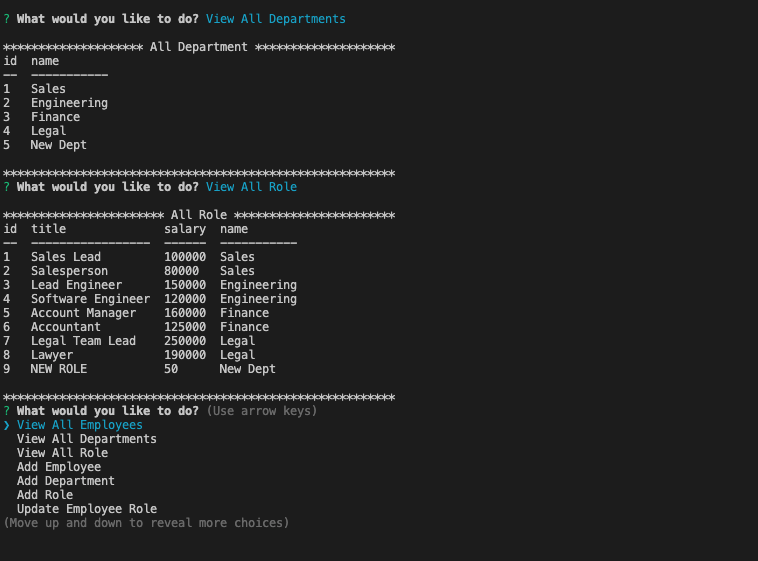

# **Employee Tracker**

  

  ## Description

  This Node application help company to manage company information such as employees, department, manager, role, salary, title.

  ## Table of Contents
  * [Description](#description)
  * [Installation](#installation-instructions)
  * [Usage](#usage)
  * [License](#license)
  * [Contributions](#contributions-guidelines)
  * [Tests](#test-instructions)
  * [Questions](#questions)

  ## Installation Instructions
     git clone https://github.com/eycs0317/employeeTracker.git
     npm install
     Insert mysql password on index.js line 12
     Login to mysql in terminal under db folder directory.
     Run command 'SOURCE schema.sql' to create the database.
     RUN command 'SOURCE seeds.sql' for sample data.

  ## Usage
  After the installation, you can run the command 'npm start' in the terminal to start.

  ## License
[MIT License](https://opensource.org/licenses/MIT)

  ## Contributions Guidelines
  None

  ## Test Instructions
  none

  ## Sample Image

  

  ## Video Link

  [Link](https://drive.google.com/file/d/1Y7_1F9FX9c0GuBU8OOQ8fw8FLNalNP-v/view)

  ## Questions
  If you have any questions: eycs0317@gmail.com

  [My GitHub](https://github.com/eycs0317)